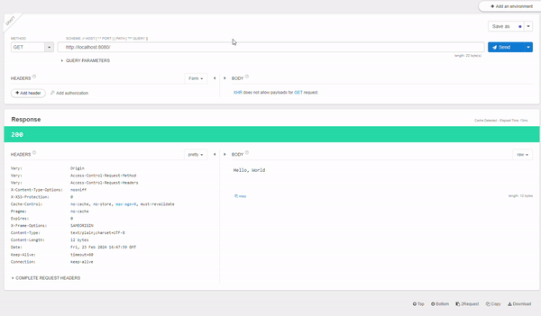

# TODO
- [ ] 구글/네이버 로그인 넣기 
- [ ] 세션 만들기
- [ ] AuthenticationEntryPoint

# Security 2.7 -> Security 3.x

### AuthenticationManager 변경 이슈
- error : 'authenticationManager must be specified'
- 2.7.x 버전부터 선언방식이 변경되면서 AuthenticationManager를 다른 방식으로 설정을 해줬어야 했습니다.
```
@Configuration
@EnableWebSecurity
public class SecurityConfig {

    @Bean
    public SecurityFilterChain filterChain(HttpSecurity http) throws Exception {

        // `authenticationManager must be specified 해결`
        AuthenticationManagerBuilder sharedObject = http.getSharedObject(AuthenticationManagerBuilder.class);
        AuthenticationManager authenticationManager = sharedObject.build();

        http.authenticationManager(authenticationManager);
```

-----



# 개발 내용

## UsernamePasswordAuthenticationFilter 
- Jwt 인증 Filter
```
1. 로그인 시도.
2. PrincipalDetailService@loadUserByUsername() 실행 -> 유저 DB 확인
3. PrincipalDetails을 세션에 저장.
4. JWT 토큰 생성
```

## BasicAuthenticationFilter]
- Jwt 권한 Filter
1. header의 'Authorization' 읽음
2. JWT에서 username 추출
3. PrincipalDetails 로 Authentication 생성
4. SecurityContext에 저장.


## 더미 데이터 저장
```
1. data.sql 스크립트 파일 (src/main/resource) 에 넣어두기
2. @PostConstruct
3. @ApplicationRunner
```
----

# TMI
## /login 은 안만들었는데? 어떻게 가능하지?
- `UsernamePasswordAuthenticationFilter`를 다시 등록하면, /login 등록되어 사용 가능.
```
--securityConfig.java--
addFilter(UsernamePasswordAuthenticationFilter.class)
```
